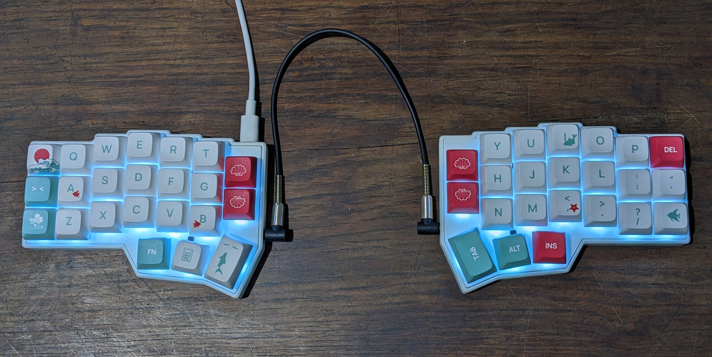
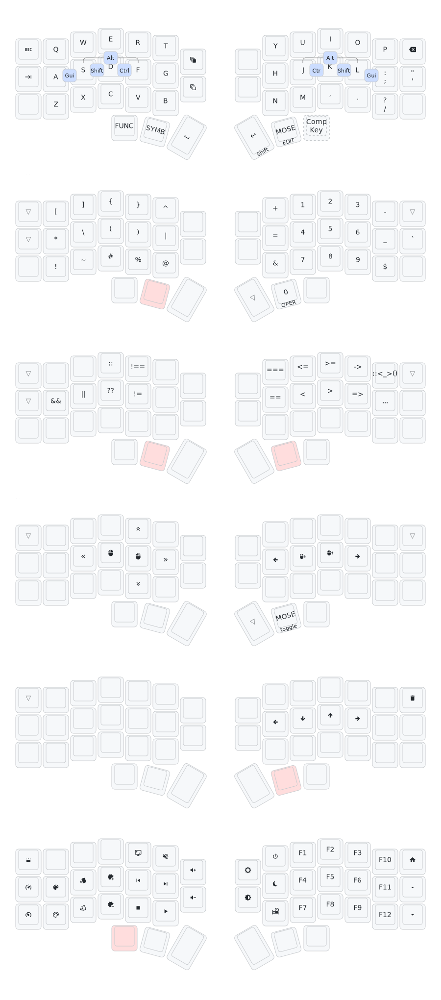

# licorne.qmk

My personal custom QMK firmware and [configuration](./keyboards/crkbd/keymaps/luckasranarison) for the [Corne](https://github.com/foostan/crkbd) V4.1 keyboard. Designed to be simple and programming friendly, with platform specific features in mind.

## Keymaps

> [!NOTE]
> `Comp Key` resolves to `Caps Lock` but it is used as a [compose key](https://en.wikipedia.org/wiki/Compose_key) for typing non-standard english characters.

## Add-ons

### GNOME Desktop integration

Adds a VIM like layer indicator and a WPM indicator as a tray icon on the left of the GNOME panel, using [qmk-hid](https://github.com/luckasRanarison/qmk-hid/).

## TODOs

- Condition based RGB effects
